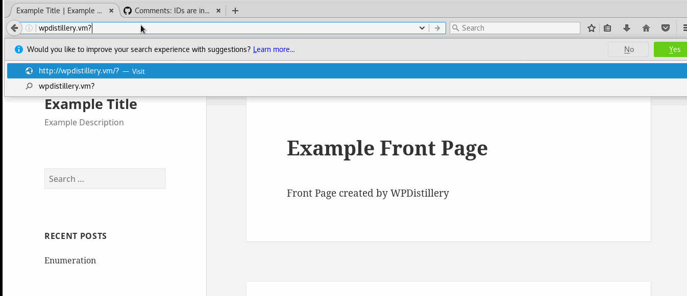
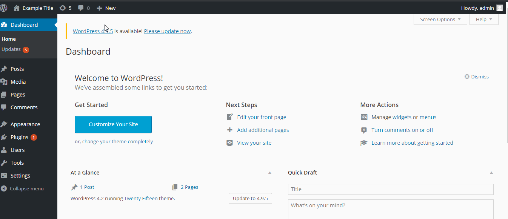
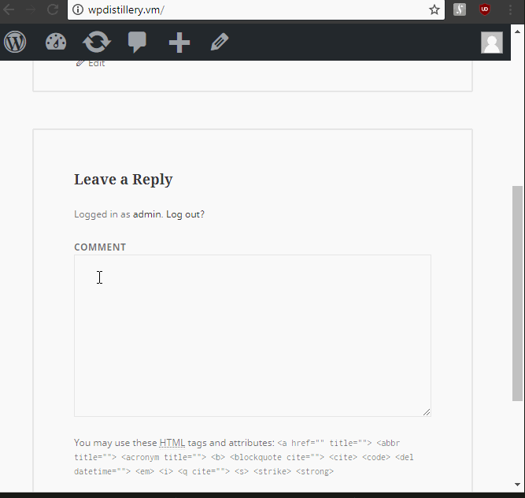

# Project 7 - WordPress Pentesting

Time spent: **17** hours spent in total

> Objective: Find, analyze, recreate, and document **five vulnerabilities** affecting an old version of WordPress

## Pentesting Report

test <a src=test onerror=alert(document.cookie)>

1. User Enumeration
  - [x] Summary: 
    - Vulnerability types: User Enumeration
    - Tested in version: 4.2
    - Fixed in version: Not yet fixed
  - [x] GIF Walkthrough: 
    
  - [x] Steps to recreate: 
    - Add an API request on the end of the site URL:  
	```
	/your-site-url/?author=#
	```
	- The number represents the index of the user.
	- Then checkout the web and you will see popups.
  - [x] Affected source code:
    - Your theme's functions.php file.
	- Your site’s root .htaccess file.

2. Authenticated Stored Cross-Site Scripting (XSS)
  - [x] Summary: 
    - Vulnerability types: XSS
    - Tested in version: 4.2
    - Fixed in version: 4.2.4
  - [x] GIF Walkthrough: 
    
  - [x] Steps to recreate: 
    - Create a new post.  
	- Add the following script at the end of your title:  
	```
	
	```
	- Then checkout the web and you will see popups.
  - [x] Affected source code:
    - [Link 1](https://core.trac.wordpress.org/changeset/33360)

3. Unauthenticated Stored Cross-Site Scripting (XSS)
  - [x] Summary: 
    - Vulnerability types: XSS
    - Tested in version: 4.2
    - Fixed in version: 4.2.4
  - [x] GIF Walkthrough: 
    
  - [x] Steps to recreate: 
    - Comment the following in a page/post:  
	```
	<a title='x onmouseover=alert(unescape(/Unauthenticated%20Stored%20Cross-Site%20Scripting/.source)) style=position:absolute;left:0;top:0;width:5000px;height:5000px  ######random characters to make it over 64KB#####'></a>
	```
	- You should be able to see a pop-up.
  - [x] Affected source code:
    - [Link 2](https://core.trac.wordpress.org/browser/tags/4.2/src/wp-content/themes/twentyfifteen/genericons/example.html?rev=32282#L309)


## Assets

[WPSeed](https://github.com/flurinduerst/WPSeed/blob/master/README.md)

## Resources

- [WordPress Source Browser](https://core.trac.wordpress.org/browser/)
- [WordPress Developer Reference](https://developer.wordpress.org/reference/)

GIFs created with [LiceCap](http://www.cockos.com/licecap/).

## Notes

I wasn't able to actually create a permalink.
I am suspecting it was due to the fact that PS didn't have the permission to create a cache folder in my Windows OS root directory.  
The work around for the above situation was to install WPSeed packet with npm, nodejs and gulp.  
For some reason some xss commands do not work, but others did which worked out.

## License

    Copyright [2018] [Eun Il Kim]
